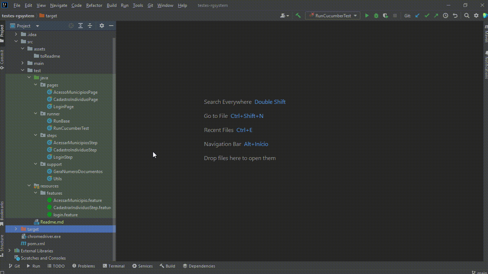

# Documentação Para Uso dos Testes Automatizados

### Ferramentas Utilizadas:

- Java: https://www.java.com/pt-BR/download/ie_manual.jsp?locale=pt_BR
- Intellij: https://www.jetbrains.com/idea/
- Google: https://www.google.com/intl/pt-BR/chrome/
- WebDriver: https://chromedriver.chromium.org/downloads

### O que esse projeto faz:

- [X] Testa a funcionalidade de Login (login válido, inválido e login seguido de logout)
- [X] Testa o carregamento dos clientes
- [X] Testa o cadastro completo de um Individuo

## Relatório de Testes:

    

##  Caso queira gerar/executar o relatório:

    

OBS.: O Webdriver precisa acompanhar a versão do seu navegador:

